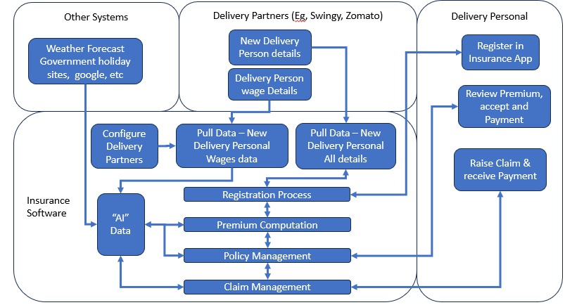

# GigGuard — AI-Powered Parametric Insurance for India's Gig Economy

> Guidewire DEVTrails 2026 | Problem Statement: AI-Powered Insurance for India's Gig Economy

---

## Table of Contents

- [Overview](#overview)
- [The Problem](#the-problem)
- [Our Solution](#our-solution)
- [Persona & Scenarios](#persona--persona-based-scenarios)
- [Application Workflow](#application-workflow)
- [Weekly Premium Model](#weekly-premium-model--how-it-works)
- [Parametric Triggers](#parametric-triggers)
- [AI/ML Integration](#aiml-integration)
- [Tech Stack](#tech-stack)
- [Architecture](#architecture-diagram)
- [Development Plan](#development-plan)

---

## Overview

GigGuard is an AI-enabled parametric insurance platform designed exclusively for platform-based delivery partners in India (Zomato, Swiggy, Zepto, Amazon, Blinkit, etc.). It protects their income — not their vehicles or health — against uncontrollable external disruptions such as extreme weather, severe pollution, and sudden curfews.

GigGuard operates on a weekly pricing model aligned with the gig worker's earnings cycle, and uses machine learning to dynamically compute premiums, predict regional risk, automate the claims process, and detect fraud — all with near-zero human intervention.

---

## The Problem

India's gig delivery workforce is the backbone of the digital economy. However, workers are fully exposed to external disruptions — heavy rainfall, floods, AQI spikes, curfews — that can wipe out 20-30% of their monthly earnings with no safety net. No existing insurance product is designed around the week-to-week financial reality of a delivery partner.

---

## Our Solution

GigGuard solves this with four core pillars:

1. AI-Powered Weekly Premiums — Dynamic, hyper-local risk pricing computed weekly using ML models trained on weather forecasts, location risk, earnings history, loyalty, and cross-platform activity.
2. Profit-Aware Regional Pricing — The AI model monitors upcoming weather probability by region and adjusts premiums proactively to ensure the company never operates at a loss, without penalising workers in low-risk zones.
3. Parametric Automation — Real-time monitoring of disruption triggers (rain, AQI, curfew data). When a threshold is crossed, claims are automatically initiated and payouts processed with no manual filing required.
4. Intelligent Fraud Detection — Anomaly detection, GPS validation, minimum eligibility verification, and duplicate prevention to ensure payout integrity.

> Coverage Scope: Income loss ONLY. Health, life, accidents, and vehicle repair coverage are strictly excluded.

---

## Persona & Persona-Based Scenarios

### Chosen Persona: Food Delivery Partners (Zomato / Swiggy)

Food delivery riders are the most weather-sensitive segment — two-wheeler riders who operate outdoors across all hours and cannot work in extreme rain, heat, or poor visibility. They are paid per delivery and lose income the moment deliveries stop.

GigGuard also supports multi-platform workers — a single worker can be registered with Zomato in the morning and Amazon Flex in the evening. GigGuard handles both.

---

### Scenario 1 — Heavy Rainfall (Environmental Disruption)

Character: Ravi, a Zomato delivery partner in Chennai, working 8 hours/day, earning approximately Rs. 2,800/week across Zomato and Amazon Flex combined.

Event: IMD issues a Red Alert for Chennai. Rainfall exceeds 64.5mm in 24 hours. Zomato suspends delivery operations in affected zones.

GigGuard Response:
- Weather API detects rainfall threshold breach at 6:14 AM.
- GigGuard automatically creates a claim for Ravi's policy covering that disruption window.
- AI validates: Ravi's GPS confirms he was in the active zone; no deliveries were logged on any registered platform; no duplicate claim exists; eligibility check passes (Ravi has worked 3+ weeks).
- Payout of Rs. 175 (50% of daily wage for disrupted hours) is transferred to Ravi's UPI/bank in under 10 minutes.
- Ravi receives an app notification: "GigGuard has credited Rs. 175 to your account for today's disruption."

---

### Scenario 2 — Severe Air Pollution (Environmental Disruption)

Character: Priya, a Swiggy delivery partner in Delhi, 8 hours/day, Rs. 2,400/week average.

Event: AQI in Priya's zone crosses 401 (Severe category). Delhi government issues a GRAP advisory halting two-wheeler movement.

GigGuard Response:
- AQI API detects threshold breach (>400) in Priya's registered zone.
- Parametric trigger fires; GigGuard auto-initiates claim.
- Fraud engine checks: GPS confirms Priya was not working (no delivery pings in platform data), cross-references GRAP bulletin.
- Payout processed for lost hours. Priya does not need to file anything manually.

---

### Scenario 3 — Unplanned Curfew / Section 144 (Social Disruption)

Character: Arjun, a multi-platform rider in Bengaluru registered on both Swiggy and Amazon Flex, working evening slots from 5 PM to 11 PM.

Event: Local authorities impose a sudden Section 144 curfew in a 3-km radius. Arjun's zone is locked down for 4 hours during his peak earning window.

GigGuard Response:
- GigGuard ingests government notification feeds and news APIs.
- Curfew zone is matched against Arjun's registered delivery zone across both platforms.
- Parametric trigger fires; claim auto-created for the disrupted 4-hour window.
- Payout released after fraud validation confirms inactivity across all of Arjun's platform logs.

---

## Application Workflow

```
Delivery Partner Onboards
        |
        v
[Registration Process]
  |-- Partner submits details via App/Web
  |-- Selects one or more delivery platforms (Zomato, Swiggy, Amazon, etc.)
  |-- AI runs background verification across all selected platforms
  |-- Platform APIs pull wage and activity data from each platform
  |-- AI checks minimum eligibility: worker must have 2+ weeks of verified activity
  |-- AI Risk Profile generated (zone, hours, earnings history, multi-platform score)
        |
        v
[Premium Computation]
  |-- ML model computes weekly premium
  |-- Regional weather probability for next week is factored in
  |-- Loyalty discount applied if worker has consistent payment history
  |-- AutoPay discount applied if enabled
  |-- Worker reviews premium and policy terms
  |-- Worker pays weekly premium (UPI / auto-debit)
        |
        v
[Policy Management]
  |-- Active policy monitored in real-time
  |-- Disruption triggers polled every 15 minutes
  |-- Policy dashboard visible to worker and insurer
        |
        v
[Disruption Detected - Parametric Trigger Fires]
  |-- External condition threshold crossed (Weather / AQI / Curfew)
  |-- Fraud validation runs automatically across all registered platforms
  |-- Claim auto-initiated for valid claims
        |
        v
[Claim Management and Payout]
  |-- Payout calculated based on disrupted hours x daily wage rate
  |-- Payment disbursed via UPI / bank transfer
  |-- Worker notified via app
```

---

## Weekly Premium Model — How It Works

### Why Weekly?

Gig workers operate week-to-week. Daily income is variable. A monthly premium model does not align with their cash flow — they may not have Rs. 200 upfront but can afford Rs. 20-60 per week, auto-deducted from platform payouts.

---

### Dynamic Premium Calculation (ML-Driven)

The weekly premium is not flat. It is dynamically computed every week using our ML model based on the following factors:

| Feature | Description | Impact |
|---|---|---|
| `zone_risk_score` | Historical disruption frequency in the worker's delivery zone | High-risk zone increases premium |
| `weather_forecast_7d` | Predicted weather severity and rain probability for the upcoming week | High rain probability increases regional premium |
| `aqi_forecast_7d` | Air Quality Index prediction for the zone | AQI > 300 forecast increases premium |
| `worker_earnings_avg` | 4-week rolling average daily earnings from all registered platforms combined | Higher earnings = higher coverage need = adjusted premium |
| `regional_exposure_factor` | Expected claim volume for the region next week based on weather probability | Prevents company loss in high-claim weeks |
| `loyalty_discount` | Weeks of continuous uninterrupted premium payment | Each week reduces premium slightly; resets on lapse |
| `autopay_discount` | Whether the worker has enabled automatic weekly deduction | Flat 5% discount applied for enabling autopay |
| `multi_platform_score` | Number of verified platforms and combined earnings reliability | More verified platforms = stronger profile = slight discount |
| `historical_claim_rate` | Zone-level claim frequency from past data | High claim zone adjusts base premium upward |
| `public_holiday_flag` | Government holiday calendar check | Holiday week lowers expected disruption risk |

---

### Profit Protection — Regional Surge Pricing

This is one of GigGuard's core business intelligence features. The AI model continuously monitors weather forecast probability by city and region. If the probability of rain or a major disruption event is high for a specific region next week, the model increases the premium for workers in that region only.

Why this matters: When rain is forecast, almost every delivery worker in that zone will purchase or renew insurance that week. Without a pricing adjustment, the company would pay out far more than it collected. The AI balances this by increasing premiums proportionally in high-risk regions before the event occurs, ensuring the company remains profitable across all regions.

Example:
- Chennai forecast shows 80% probability of heavy rain next week.
- The model detects that approximately 2,400 active workers in Chennai will likely trigger claims.
- Regional exposure factor is raised for Chennai for that week only.
- Workers in Chennai pay a slightly higher premium that week — say Rs. 55 instead of Rs. 40.
- Workers in Pune (clear weather forecast) continue paying Rs. 35 — completely unaffected.
- The company collects enough premium in Chennai to cover the expected payout volume and maintain its profit margin.

This adjustment is fully automated. No human intervention is needed. The model recalculates every Monday before the new policy week begins.

---

### Loyalty and AutoPay Discounts

GigGuard rewards consistency. Workers who pay regularly and enable autopay are lower operational cost and lower fraud risk, and the model reflects this:

- Loyalty Discount: For every continuous week of uninterrupted premium payment, the worker earns a small discount accumulating up to a maximum of 15% off base premium. The discount resets if the worker misses a payment.
- AutoPay Discount: Workers who enable automatic weekly deduction receive a flat 5% discount on their weekly premium. This also reduces payment failure risk for GigGuard.

These discounts are automatically factored into the ML model output each week — workers see a lower premium over time simply by staying consistent.

---

### Premium Formula (Simplified)

```
Base Premium = Weekly Earnings Avg x Coverage Rate (3.5%)

Dynamic Multiplier = f(zone_risk_score, weather_forecast, aqi_forecast, regional_exposure_factor)

Final Weekly Premium = Base Premium x Dynamic Multiplier x (1 - Loyalty Discount) x (1 - AutoPay Discount)

Coverage Payout = Disrupted Hours x (Weekly Earnings Avg / Active Hours in Week)
```

**Why 3.5%?**
A coverage rate of 3.5% means a worker earning Rs. 2,000/week pays just Rs. 70 as their base premium — roughly Rs. 10/day, less than a cup of tea. Yet when a disruption strikes and 6 hours of work are lost, the payout can be Rs. 300-500. The worker gets back 4-7x what they paid that week. This rate is affordable for the worker while still allowing GigGuard to remain profitable through the regional exposure model and by pooling risk across thousands of workers in low-risk zones.

Example (Typical Full-Time Rider — Single Platform):
- Kiran's 4-week average earnings on Swiggy: Rs. 2,000/week
- Base coverage rate: 3.5% — Base Premium = Rs. 70
- Zone risk multiplier: 1.05 (moderate zone)
- Weather forecast multiplier: 1.08 (mild rain chance next week)
- Loyalty discount: 5% (5 weeks continuous payment)
- AutoPay discount: 5% (enabled)
- Final Premium = Rs. 70 x 1.05 x 1.08 x 0.95 x 0.95 = approximately Rs. 72/week

Example (Multi-Platform Rider — Higher Earner):
- Ravi's 4-week average earnings across Zomato + Amazon Flex: Rs. 2,800/week
- Base coverage rate: 3.5% — Base Premium = Rs. 98
- Zone risk multiplier: 1.05 (moderate zone, Chennai)
- Weather forecast multiplier: 1.10 (moderate rain forecast next week)
- Loyalty discount: 8% (8 weeks continuous payment)
- AutoPay discount: 5% (enabled)
- Final Premium = Rs. 98 x 1.05 x 1.10 x 0.92 x 0.95 = approximately Rs. 99/week

---

### Premium Tiers (Indicative)

| Coverage Tier | Typical Weekly Earnings | Weekly Premium | Max Weekly Payout | Best For |
|---|---|---|---|---|
| Basic Shield | Rs. 800 - 1,500 | Rs. 20 - 40 | Rs. 500 | Part-time riders, weekend-only workers |
| Standard Guard | Rs. 1,500 - 3,000 | Rs. 40 - 80 | Rs. 1,200 | Regular full-time single-platform riders |
| Pro Protect | Rs. 3,000 - 5,000+ | Rs. 80 - 130 | Rs. 2,500 | High-earning or multi-platform riders |

The ML model selects the most appropriate tier automatically based on the worker's verified earnings and allows the worker to upgrade or downgrade at any time.

---

## Multi-Platform Worker Support

A delivery worker in India rarely works for just one platform. The same person may deliver food on Zomato in the morning, switch to Amazon Flex for packages in the afternoon, and take Blinkit grocery runs in the evening. GigGuard is built to handle this.

During registration, the worker selects all the delivery platforms they work with. GigGuard then:

1. Runs an AI-powered background verification on each selected platform — checking that the worker has a verified active account and minimum work history on that platform.
2. Pulls earnings and activity data from all registered platforms via their respective APIs (simulated in Phase 1, real integration in later phases).
3. Computes a combined earnings profile across all platforms for a more accurate weekly earnings average and risk score.
4. During claim validation, cross-checks inactivity across all registered platforms — a valid claim requires that no delivery activity was logged on any platform during the disruption window.

This multi-platform check also strengthens fraud detection. A worker cannot claim income loss on Swiggy while simultaneously delivering on Amazon Flex during the same disruption window.

---

## Parametric Triggers

Parametric insurance means the event data triggers the claim — not a manual complaint. When a pre-defined measurable threshold is crossed, the system acts automatically.

### Trigger Table

| Trigger ID | Disruption Type | Data Source | Threshold | Payout Trigger |
|---|---|---|---|---|
| T-01 | Heavy Rainfall | OpenWeatherMap / IMD API | Rainfall > 64.5mm/24h (Red Alert) OR > 35.5mm/3h | Auto-claim for affected zone |
| T-02 | Extreme Heat | OpenWeatherMap | Temperature > 45 degrees C AND Heat Index > 54 degrees C | Auto-claim if active in zone |
| T-03 | Severe Air Pollution | CPCB AQI API / OpenAQ | AQI > 400 (Severe) AND official advisory issued | Auto-claim for GRAP-restricted zones |
| T-04 | Flood / Waterlogging | OpenWeatherMap + Google Maps Traffic API | Zone tagged as flooded / road closures detected | Auto-claim for registered zone |
| T-05 | Curfew / Section 144 | Government notification RSS / News API | Official order detected in registered zone | Auto-claim for disrupted window |

### How Triggers Work

```
Every 15 minutes:
  |-- Poll all data sources for active worker zones
  |-- Compare against thresholds
  |-- If threshold crossed, flag disruption event
  |-- Match event zone to policies active in that zone
  |-- Run fraud validation pipeline (including multi-platform cross-check)
  |-- If valid, auto-initiate claim and payout
```

---

## AI/ML Integration

### 1. Dynamic Premium Calculation (XGBoost)

- Model Type: Gradient Boosted Regression (XGBoost)
- Training Data: Synthetic and historical weather events, IMD disruption records, simulated delivery platform earnings data
- Features: Zone risk score, weather forecast, AQI forecast, regional exposure factor, combined earnings average across all platforms, claim history, loyalty weeks, autopay status, holiday calendar
- Output: Weekly premium amount (Rs.) and recommended coverage tier
- Retraining: Model retrained weekly with new disruption event outcomes and actual claim data

### 2. Regional Profit Protection Model (XGBoost + Time-Series Forecasting)

- Model Type: XGBoost regressor combined with weather probability time-series forecasting
- Purpose: Predict the expected claim payout volume for each city/region for the upcoming week, and compute the minimum premium required to cover expected payouts plus a target profit margin
- How it works: Every Monday, the model ingests the 7-day weather probability forecast for each active region. It estimates the number of workers likely to claim, calculates expected total payout, and outputs the regional exposure factor — a multiplier applied only to that region's premium for that week
- Output: Per-region premium multiplier for the upcoming week, automatically applied without human input

### 3. Fraud Detection Engine (Isolation Forest + Rule-Based Layer)

- Model Type: Isolation Forest (unsupervised anomaly detection) combined with hard rule checks
- Fraud Signals Detected:
  - GPS location mismatch: worker not in claimed disruption zone at time of event
  - Delivery activity detected during claimed disruption window across any registered platform
  - Duplicate claim: same worker, same event, multiple submissions
  - Abnormal claim frequency relative to zone peers
  - GPS spoofing: sudden unrealistic location jumps detected
  - New registration fraud: worker registers and attempts to claim within the minimum eligibility window
- Output: Fraud risk score from 0 to 1. Score above 0.75 flags for manual review. Score above 0.9 auto-rejects.

### 4. Minimum Eligibility Verification

A critical fraud prevention layer. A worker who registers knowing that heavy rain is forecast for next week, takes out insurance, files a claim, and disappears is a well-known adverse selection attack. GigGuard prevents this by enforcing a minimum verified work history before a worker is eligible to purchase insurance.

The minimum eligibility threshold is set at 2 weeks of verified active delivery history on at least one registered platform. This threshold was chosen because:

- 1 week is too short and still allows opportunistic rain-season registrations.
- 3 weeks or more may exclude genuine new workers who need coverage quickly.
- 2 weeks strikes the right balance — it filters out most opportunistic fraud while keeping the product accessible to workers who are genuinely new to gig delivery.

The model verifies this by checking the worker's account creation date and delivery activity logs on each registered platform via the background verification step during onboarding. If the worker does not meet the threshold, they are offered a provisional registration with insurance eligibility unlocked automatically once their 2-week verification window is complete.

### 5. Risk Profiling (K-Means Clustering + Scoring)

- Model Type: K-Means clustering for zone-level risk segmentation and logistic scoring for worker profile
- Purpose: Assign each delivery zone a risk tier (Low / Medium / High / Extreme) based on historical disruption frequency, drainage quality, curfew history, and platform activity density
- Worker-level: Individual risk score considering zone history, hours worked, multi-platform activity, account age, claim history, and loyalty weeks

### 6. Predictive Analytics Dashboard (For Insurers)

- Model: Time-series forecasting (Prophet / LSTM) to predict next week's likely claim volume by zone
- Output: Insurer admin dashboard showing predicted loss ratio, zone-wise exposure heatmap, upcoming high-risk days, and premium adequacy indicators per region

---

## Tech Stack

| Layer | Technology | Purpose |
|---|---|---|
| Web App | React (TypeScript) | Worker-facing web portal and insurer admin dashboard |
| Mobile App | React Native | iOS and Android app for delivery partners |
| Backend API | Node.js + Express + TypeScript | REST API server, business logic, policy engine |
| AI/ML Services | Python (FastAPI) | ML model serving — premium calculation, fraud detection, risk profiling, regional exposure model |
| ML Libraries | Scikit-learn, XGBoost, Pandas, NumPy, Prophet | Model training and inference |
| Database | PostgreSQL | Policies, claims, worker profiles, transactions |
| Cache / Queue | Redis | Real-time trigger polling, job queues for claim processing |
| External APIs | OpenWeatherMap, CPCB AQI, IMD RSS, Google Maps | Parametric trigger data sources and weather probability forecasting |
| Payment (Mock) | Razorpay Test Mode / UPI Simulator | Simulated payout processing |
| Authentication | JWT + OAuth2 | Secure worker and admin login |
| DevOps | Docker, GitHub Actions | Containerisation, CI/CD |
| Cloud | AWS (EC2, RDS, S3, Lambda) | Hosting, storage, serverless trigger workers |

---

## Architecture Diagram

The architecture below shows the complete system design for GigGuard, covering the interactions between delivery platforms (Zomato/Swiggy/Amazon), the insurance software core, external data systems, and delivery partners.



Key Architectural Components:

- Delivery Partner App (React Native): Onboarding, multi-platform registration, policy review, premium payment, claim status, payout notifications.
- Web Portal (React): Insurer admin dashboard — policy management, fraud review, analytics, zone risk maps, regional exposure view.
- Backend (Node.js + Express): Core business logic — registration, eligibility verification, policy engine, premium computation orchestration, claim management.
- AI/ML Service (Python + FastAPI): Separate microservice for ML inference — premium model, regional exposure model, fraud model, eligibility checker, risk profiling. Consumed by the backend via internal REST calls.
- Parametric Trigger Worker (Python + Redis Queue): Runs every 15 minutes, polls all external APIs, evaluates thresholds, publishes disruption events to the claim engine.
- External Integrations: Weather APIs (OpenWeatherMap / IMD), AQI APIs (CPCB / OpenAQ), Platform APIs (simulated Zomato/Swiggy/Amazon data), Government advisory feeds.
- AI Data Store: Historical disruption data, zone risk scores, weather patterns, regional claim history — feeds the ML models for training and inference.

---

## Development Plan

### Phase 1 — Ideation and Foundation [March 4-20] (Seed Phase)

Theme: "Ideate and Know Your Delivery Worker"

| Week | Tasks |
|---|---|
| Week 1 | Finalise persona (Food Delivery — Zomato/Swiggy). Define parametric triggers. Design data models (worker, policy, claim, payout, multi-platform profile). Set up project repo and CI/CD pipeline. |
| Week 2 | Build registration flow with multi-platform selection (web and app). Set up backend scaffolding (Node/Express/TypeScript). Integrate OpenWeatherMap API. Design eligibility verification flow. Build wireframes for worker app and admin dashboard. Produce architecture diagram. |

Deliverable: README (this document) + Git repository + 2-minute strategy video.

---

### Phase 2 — Automation and Protection [March 21 - April 4] (Scale Phase)

Theme: "Protect Your Worker"

| Week | Tasks |
|---|---|
| Week 3 | Build Registration Process with multi-platform background verification and eligibility check. Build Insurance Policy Management module. Integrate simulated platform APIs (Zomato/Swiggy/Amazon worker data). Train initial XGBoost premium model on synthetic data including loyalty, autopay, and regional exposure features. |
| Week 4 | Build Dynamic Premium Calculation API (Python ML service) including regional profit protection model. Build Claims Management module. Implement triggers T-01 to T-05. Build basic fraud detection rules including new-registration fraud check. Connect React Native app to backend APIs. |

Deliverable: Executable source code + 2-minute demo video showcasing Registration, Policy Management, Dynamic Premium Calculation, and Claims Management.

---

### Phase 3 — Scale and Optimise [April 5-17] (Soar Phase)

Theme: "Perfect for Your Worker"

| Week | Tasks |
|---|---|
| Week 5 | Upgrade fraud detection to Isolation Forest ML model. Add GPS spoofing detection and multi-platform inactivity cross-check. Integrate Razorpay test mode for simulated instant payouts. Build Worker Dashboard (earnings protected, active coverage, claim history, loyalty discount tracker). |
| Week 6 | Build Insurer Admin Dashboard (loss ratios, predictive analytics, regional exposure heatmap, premium adequacy indicators). Polish UX across web and mobile. Stress-test parametric trigger pipeline. Record 5-minute final demo video. Prepare final pitch deck (PDF). |

Deliverable: Advanced fraud detection + instant payout simulation + intelligent dashboards + 5-minute demo video + final pitch deck PDF.

---

## Critical Constraints (Per Problem Statement)

- Coverage Scope: Income loss ONLY — no health, life, accident, or vehicle repair coverage.
- Weekly Pricing: All premiums and financial models are structured on a weekly basis.
- Persona: Food delivery partners (Zomato / Swiggy / Amazon) with multi-platform support.
- Parametric Only: Claims triggered by external data thresholds — not by self-reported incidents.
- Minimum Eligibility: Workers must have a verified 2-week active delivery history before insurance is activated.

---

*Built for Guidewire DEVTrails 2026 | Team GigGuard*
